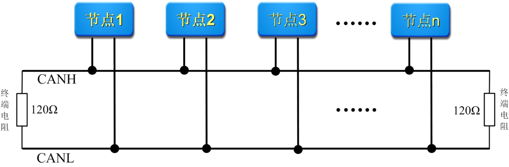

# 嵌入式

[嵌入式](#嵌入式)

- [第一章](#第一章)
- [第二章](#第二章)
- [第三章](#第三章)
- [第四章](#第四章)
- [第五章](#第五章)
- [第六章](#第六章)
- [第七章](#第七章)
- [第八章](#第八章)
- [第九章](#第九章)
- [第十章](#第十章)
- [Tips](#tips)

[back](../README.md)

## 第一章

### 1.嵌入式系统的含义及三要素

简单定义：嵌入到对象体系中的专用计算机系统(完整定义在P1)  
三个要素： 嵌入性、专用性、计算机系统

### 2.嵌入式系统的主要特点

&emsp;1.是专用的计算机系统  
&emsp;2.对环境的要求  
&emsp;3.必须是能满足对象系统控制要求的计算机系统  
&emsp;4.集计算机技术与各行业于一体的集成系统  
&emsp;5.具有较长的生命周期  
&emsp;6.软件固化在非易失性存储器中  
&emsp;7.嵌入式系统的实时性要求  
&emsp;8.需专用开发环境和开发工具进行设计

### 3.嵌入式系统的组成，典型嵌入式系统的硬件组成包括哪些部分

&emsp;嵌入式系统组成包括软件和硬件两部分(P7)  
&emsp;硬件组成：嵌入式最小系统、输入通道、输出通道、人机交互通道以及通信互联通道

### 4.嵌入式系统在航空航天领域的应用，分析我国嵌入式系统的技术现状及发展措施

## 第二章

### 1.ARM处理器的显著特点有哪些？--P28

&emsp;性价比高，低功耗，代码密度高。

### 2.ARM工作状态和工作模式--P30

&emsp;ARM工作状态有三种：一是ARM状态；二是Thumb状态及Thumb-2状态；三是调试状态。

&emsp;ARM工作模式：

&emsp;&emsp;1.经典ARM处理器的工作模式。

&emsp;&emsp;&emsp;经典ARM支持七种工作模式，具体哪种模式取决于状态寄存器CPSR低5位的值。

&emsp;&emsp;2.ARM Cortex-M系列嵌入式处理器的线程模式及特权级

&emsp;&emsp;&emsp;ARM Cortex-M系列处理器即微控制器，有两种模式，一是线程模式（执行普通代码的工作模式），二是处理模式（处理异常中断的工作模式）。

### 3.ARM Cortex-M异常中断及中断向量（P41）、堆栈（P41）、中断类型号、中断号及中断向量存放地址的关系(要会计算)--P38

&emsp;异常中断及中断向量--P41

&emsp;堆栈：地址递减（每压入堆栈，地址减4，弹出堆栈，地址加4），先进后出。

&emsp;中断号=中断类型号-16

&emsp;中断向量存放地址=4*中断类型号=4*（中断号+16）

### 4.ARM存储格式（P42）及数据类型（P43）

&emsp;存储格式有两种：大端模式和小端模式（默认）。

&emsp;数据类型：支持字节（8位），半字（16位），字（32位）三种。（对齐）

### 5.AMBA总线及基于该总线的嵌入式处理器组成及特点--P45

### 6.经典芯片STM32F10X的内部组成--P50

## 第三章

### 1.ARM常用指令集及特点--P53~68

### 2.熟悉常用指令：AND,ORR,CMP,B,LDR,STR及LDR伪指令--看书

### 3.熟悉条件域的使用--P55

### 4.子程序及子程序调用PROC/MOV PC,LR/ENDP/BL--P83

### 5.CMSIS层次结构--P85
三个层次：
&emsp;1.内核外设访问层
&emsp;2.中间件访问层
&emsp;3.片上外设访问层

### 6.启动文件的功能--P94

主要包括链接地址描述以及各种初始化程序两大类。

&emsp;1.描述文件实现功能

&emsp;&emsp;指定程序下载的地址和指定程序执行的地址两大类。

&emsp;2.初始化程序的功能

&emsp;&emsp;异常向量的初始化，内存环境初始化以及其他硬件初始化

### 7.C中的常用运算符(|=,&=及&,|,~等常用运算符)--P101

### 8.嵌入式系统的程序结构(包括OS)--P107

包含4种基本结构，也称程序处理流程：
&emsp;1.简单轮询结构。

&emsp;2.带中断驱动的结构。

&emsp;3.轮训与中断相结合的结构。

&emsp;4.并发任务的结构。

### 9.汇编、寄存器、固件库对硬件的基本操作步骤--P111

## 第四章

### 1.嵌入式最小系统的组成 -处理器、供电、时钟、存储、复位、调试--P120

### 2.嵌入式处理器的选型原则：性价比--P120

&emsp;(1)性能：应该选择完全能够满足功能和性能要求且略有余量的嵌入式处理器，够用就行。
    
&emsp;(2)价格：在满足需求的前题下选择价格便宜的。
除了上述总体选择原则外，还可以考虑参数选择原则。可分为功能性参数选择和性能参考选择。

### 3.嵌入式最小系统的重要性

嵌入式最小硬件系统是应用到系统最简单，最基本，最不可或缺的硬件系统，简称最小系统。

## 第五章

### 1.GPIO的基本特性：输入缓冲、输出锁存

### 2.GPIO工作模式：高阻(浮空)输入、开漏、推挽输出、上下拉输入、双向输入输出

### 3.GPIO中断类型及用途

### 4.GPIO配置寄存器及工作方式编程(汇编、寄存器及固件库方式)

### 5.GPIO输入数据寄存器和输出寄存器编程(汇编、寄存器及固件库方式)

### 6.知晓逻辑电平为何要变换，有哪些方法

### 7.数字输入输出的扩展应用(并行应用)

### 8.简单人机交互接口的应用(发光管、按键)

## 第六章

### 1.通用定时器更新和比较定时，会计算定时时间并编程实现

### 2.独立看门狗定时器IWDG的作用，计算看门狗定时溢出时间。选择溢出时间的一般原则

### 3.知晓RTC及其功能

### 4.掌握输出PWM波形的方法及边沿对齐(向上计数)编程应用(周期或频率的改变方法，占空比改变方法)

## 第七章

### 1.掌握模拟输入输出系统的组成(那个框图)

### 2.了解传感器的种类，会根据实际应用选择相应传感器

### 3.知晓信号调理的主要功能任务

### 4.低通滤波设计及RC计算

### 5.掌握片上ADC的编程应用(查询三部曲)

### 6.掌握标度变换及其应用

### 7.掌握片上DAC的编程应用

## 第八章

### 1.掌握UART的字符格式及其应用--P244

字符格式：

&emsp;(1)按照低位在前、高位在后的次序进行传输；

&emsp;(2)1位起始位，5~8位数据位，1位校验位，1~2位停止位；

&emsp;(3)波特率可设置：110~115200bps

### 2.掌握 $I^2C$数据有效性和起停条件，知晓总线仲裁的原则，$I^2C$连接方法--P261

数据有效性：

&emsp;$I^2C$ SDA线上的数据必须在时钟线SCL的高电平期间保持稳定，数据线的电平状态只有在SCL线的时钟信号为低电平时才能改变。高低电平宽度必须不小于4.7μs。

启停条件：

&emsp;起始信号：在SCL线为高电平时，SDA线从高电平变为低电平。

&emsp;停止信号：在SCL线为高电平时，SDA线从低电平变为高电平。

总线仲裁原则：--P262

$I^2C$连接方法：--P263

其他：

&emsp;$I^2C$(Inter-Integrated Circuit)是集成电路互连的一种总线标准。只有两根信号线(时钟线SCL，数据线SDA)即可完成数据的传输操作。

&emsp;特点：
(1)少线同步通信总线接口；
(2)只有两根信号线，一根是时钟线SCL，一根是数据线SDA(双向三态)即可完成数据的传输操作；
(3)具有特定的起始位和终止位，可完成同步半双工串行通信方式，常用于板级芯片之间的短距离低速通信。

### 3.了解SPI的主要信号及连接方法--P269

SPI：

&emsp;SPI(Serial Peripheral Interface)是串行外设接口，总线系统是一种同步串行外设接口，它可以使MCU与各种外围设备以串行方式进行通信。

&emsp;特点：(1)同步通信，一般高位在前，低位在后；(2)通常用四线制，包括MISO(主输入从输出)、MOSI(主输出从输入)以及SSL(芯片选择)和SCK(时钟)。可完成全双工的同步串行通信，使用于板级芯片之间的短距离通信。

连接方法：--P269

### 4.掌握CAN总线的主要特点，知道CAN总线的连接方法，能解释为何要加匹配电阻120欧--P274

主要特点：

&emsp;（1）多主机控制。

&emsp;（2）通信速度快，通信距离远。

&emsp;（3）具有错误检测、错误通知和错误恢复功能。

&emsp;（4）故障封闭功能。

&emsp;（5）连接节点多。

&emsp;（6）差分信号对外部电磁干扰（EMI）具有高度免疫，同时具有稳定性。

&emsp;（7）报文采用短帧结构，传输时间短，受干扰概率低，保证了极低的速率出错率。

&emsp;（8）采用非破坏总线仲裁技术，确保最高优先级的节点数据传输不受影响。

连接方法：

加120Ω的电阻原因：作为阻抗匹配电阻，取约120Ω，以消除传输过程中的电波反射产生的干扰。

### 5.了解以太网、USB，知晓他们都是平衡传输，差分接受的传输方式(简称差分传输)，知道差分传输的优点--P286

差分传输定义：

&emsp;差分传输是一种信号传输的技术，区别于传统的一根信号线一根地线的做法，差分传输在这两根线上都传输信号，这两个信号的振幅相同，相位相反。在这两根线上的传输的信号就是差分信号。信号接收端比较这两个电压的差值来判断发送端发送的逻辑状态。在电路板上，差分走线必须是等长、等宽、紧密靠近、且在同一层面的两根线。

差分传输优点：

&emsp;抗干扰能力强。

&emsp;能有效抑制电磁干扰（RMI）。

&emsp;时序定位准确。

### 6.了解无线通信模块与嵌入式系统的连接--295

常用无线通信接口：

&emsp;无线通信接口主要包括GPS、GSM、GPRS、北斗、WiFi、蓝牙、ZigBee以及其它无线射频通信模块等。

连接：--P296

### 7.哪些是全双工、半双工通信方式

全双工方式：$UART$，$USART$，$SPI$，$USB3.0$

半双工方式：$I^2C$，$CAN$，$USB2.0$

### 8.哪些是差分传输方式？哪些抑制共模干扰更好？

差分传输：$CAN$, $USB$, 

使用差分传输的抑制共模干扰好。

## 第九章

### 1.嵌入式操作系统的一般结构

### 2.uC/OS-Ⅱ的主要特点

### 3.uC/OS-Ⅱ系统的组成与结构

### 4.uC/OS-Ⅱ的任务状态

### 5.uC/OS-Ⅱ的系统服务

### 6.任务间通信常用函数

### 7.uC/OS-Ⅱ的程序设计

## 第十章

### 1.根据要求进行需求分析和系统结构设计

### 2.按照第4章要求进行最小系统设计

### 3.按照第5章第7章的内容进行数字通道和模拟通道设计

### 4.按照第8章进行互连通道的设计

### 5.硬件原理综合(画原理图：按照经典嵌入式系统硬件组成绘制)

### 6. 按照第3章和第9章以及第5章的要求进行软件设计(按照模块或任务划分不同模块进行单独设计)

### 7.系统调试(静态调试和动态调试)

### 8.综合调试

## Tips

1.对于用汇编编程的题，相关硬件寄存器或端口的地址会列出来供使用  
2.对于自由发挥或自行设计的题目，要提前考虑。  
 &emsp;如考虑按键输入，LED发光管输出的连接及编程，ADC、DAC、定时器及PWM输出等编程应用要提前做些准备，不至于现场考虑浪费时间。
 &emsp;自行设计的题目，要会按照需求分析绘制体系结构图，硬件组成框图等关键代码，如读输入，写输入，如果有ADC则按照ADC三步曲操作

