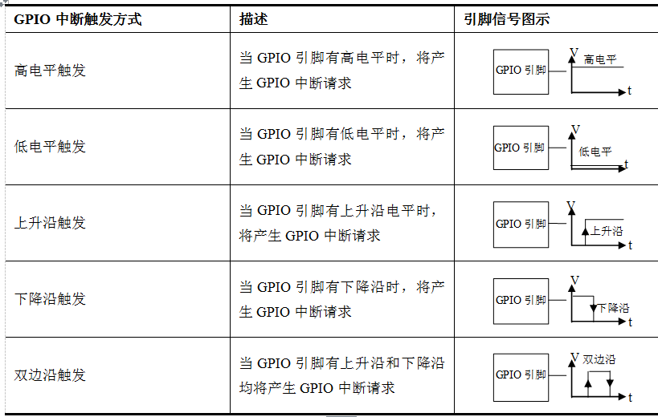
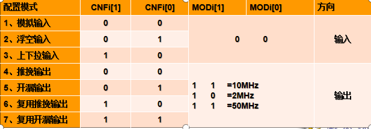
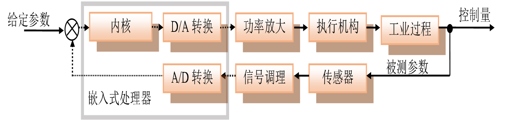
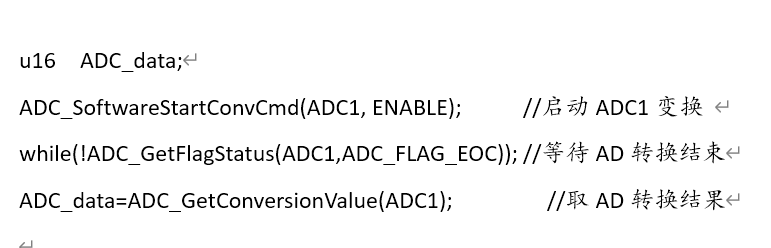
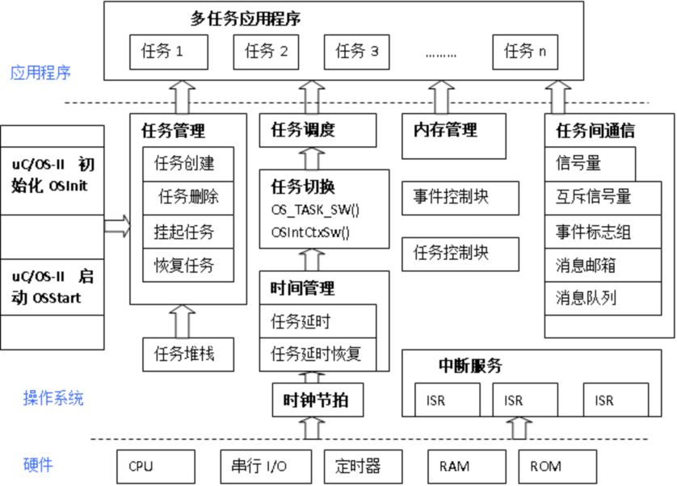

# 嵌入式

[嵌入式](#嵌入式)

- [第一章](#第一章)
- [第二章](#第二章)
- [第三章](#第三章)
- [第四章](#第四章)
- [第五章](#第五章)
- [第六章](#第六章)
- [第七章](#第七章)
- [第八章](#第八章)
- [第九章](#第九章)
- [第十章](#第十章)
- [Tips](#tips)

[back](../README.md)

## 第一章

### 1.嵌入式系统的含义及三要素

简单定义：嵌入到对象体系中的专用计算机系统(完整定义在P1)  
三个要素： 嵌入性、专用性、计算机系统

### 2.嵌入式系统的主要特点

&emsp;1.是专用的计算机系统  
&emsp;2.对环境的要求  
&emsp;3.必须是能满足对象系统控制要求的计算机系统  
&emsp;4.集计算机技术与各行业于一体的集成系统  
&emsp;5.具有较长的生命周期  
&emsp;6.软件固化在非易失性存储器中  
&emsp;7.嵌入式系统的实时性要求  
&emsp;8.需专用开发环境和开发工具进行设计

### 3.嵌入式系统的组成，典型嵌入式系统的硬件组成包括哪些部分

&emsp;嵌入式系统组成包括软件和硬件两部分(P7)  
&emsp;硬件组成：嵌入式最小系统、输入通道、输出通道、人机交互通道以及通信互联通道

### 4.嵌入式系统在航空航天领域的应用，分析我国嵌入式系统的技术现状及发展措施

&emsp;应用：飞行器黑匣子、导航仪以及飞行控制等。
&emsp;技术现状：no idea....

## 第二章

### 1.ARM处理器的显著特点有哪些？

### 2.ARM工作状态和工作模式

### 3.ARM Cortex-M异常中断及中断向量、堆栈、中断类型号、中断号及中断向量存放地址的关系(要会计算)

### 4.ARM存储格式及数据类型

### 5.AMBA总线及基于该总线的嵌入式处理器组成及特点

### 6.经典芯片STM32F10X的内部组成

## 第三章

### 1.ARM常用指令集及特点

### 2.熟悉常用指令：AND,ORR,CMP,B,LDR,STR及LDR伪指令

### 3.熟悉条件域的使用

### 4.子程序及子程序调用PROC/MOV PC,LR/ENDP/BL

### 5.CMSIS层次结构

### 6.启动文件的功能

### 7.C中的常用运算符(|=,&=及&,|,~等常用运算符)

### 8.嵌入式系统的程序结构(包括OS)

### 9.汇编、寄存器、固件库对硬件的基本操作步骤

## 第四章

### 1.嵌入式最小系统的组成 -处理器、供电、时钟、存储、复位、调试

### 2.嵌入式处理器的选型原则：性价比

### 3.嵌入式最小系统的重要性

## 第五章

### 1.GPIO的基本特性：输入缓冲、输出锁存(P143)

### 2.GPIO工作模式：高阻(浮空)输入、开漏、推挽输出、上下拉输入、双向输入输出(P144)

&emsp;Tips:复位后所有引脚自动置为高阻(浮空)输入  
高阻输入：  
由GPIO端口内部三态门控制，在读无效时呈高阻状态。  
开漏输出：  
特点  
1.输出0时，引脚能呈现低电平(0V)  
2.输出1时，由于漏极开路，引脚输出的电平不定，取决于该脚接哪儿，怎么接，输出电压的高低由接法决定。通常该脚连接一个电阻，另外一端连接到希望得到电压的电源端，电源电压据需要选择。  
推挽输出：  
输出端口采用推挽放大电路以输出更大的电流，且推挽输出逻辑1的点评是固定的为VDD，不能改变
准双向输出模式：  
可以在需要输入的时候读外部的数据(输入)，需要输出的时候就向端口发送数据。  
双向输出模式：  

上下拉输入：  
所谓上拉指的是引脚与电源VDD或VCC之间接一个大小100K左右的电阻，下拉指的是引脚与负电源VSS或地GND之间接一个100K左右的电阻。

### 3.GPIO中断类型及用途(P148)

类型：高电平触发、低电平触发、上升沿触发、下降沿触发、双边沿触发  
用途：当引脚有变化时产生一个中断请求，微控制器在中断服务程序中去做相应引脚中断的处理任务，提高效率。  

### 4.GPIO配置寄存器及工作方式编程(汇编、寄存器及固件库方式) --P149

32位配置寄存器(GPIOx_CRL、GPIOx_CRH)：配置输入输出模式和输出频率  

具体相关操作见书P149、作业、代码相关内容  

### 5.GPIO输入数据寄存器和输出寄存器编程(汇编、寄存器及固件库方式)

具体相关操作见书P151、作业、代码相关内容  

### 6.知晓逻辑电平为何要变换，有哪些方法

原因：  
因为越来越多的处理器为了节约和降低能耗，都把电源电压降低了。  
功率：P∝k×C×F×U2/R  
这样不同电源供电的芯片之间进行连接时，逻辑电平如果不一样，则必须导致信息交互的失败。  
即使同电源供电不同逻辑器件如CMOS与TTL之间逻辑电平也不致。  
因此必须进行不同逻辑之间的转换。  

方法：P153  
1.限流电阻加钳位二极管进行同相逻辑电平转换接口。  
2.用电阻与三极管构成的逻辑电平转换接口。  
3.仅用两只电阻成的逻辑电平转换接口。  
4.用专用逻辑电平转换芯片进行逻辑电平转换。  
5.采用光电耦合器实现逻辑电平隔离转换。  

### 7.数字输入输出的扩展应用(并行应用)--P158

### 8.简单人机交互接口的应用(发光管、按键)--P164

## 第六章

### 1.通用定时器更新和比较定时，会计算定时时间并编程实现(见PPT)

内部定时功能&emsp;$F_{PCLK}$时钟输入(P180)  
&emsp;定时时间确定：  
&emsp;$T＝N/f$ = $N*（PR+1）/F_{PCLK}$  
&emsp;&emsp;=$(1+TIM\_Period)((1+TIM\_Prescaler)/F_{TIMxCLK})$--(P186)  
&emsp;&emsp;对于TIM1/TIM8：$T=(1+ARR)*(1+PSC)*(RCR + 1)/F$  
则$ARR=T*F/(1+PSC)-1$&emsp;&emsp;单位：T:S,F:Hz  
外部计数功能&emsp;外部时钟输入  
&emsp;计数脉冲个数确定：  
&emsp;&emsp;$n＝N*（PR+1）$  
比较定时(P187)：定时时间T：  
&emsp;$T=CCR\_Value*((1+Prescaler)/F_{TIMxCLK})$(TIPS:书上是错的)

### 2.独立看门狗定时器IWDG的作用，计算看门狗定时溢出时间。选择溢出时间的一般原则--P195

溢出时间：$T_{IWDG}=4*2^{IWDG\_PR}*(1+IWDG\_RLR)/40KHZ$  
一般原则：喂狗周期不能大于溢出周期  

### 3.知晓RTC及其功能

RTC(Real Time Clock)实时钟组件是一种能提供日历/时钟、数据存储等功能的专用定时组件  
主要功能包括BCD数据有秒、分、时、日、月、年、闰年产生器、告警功能(告警中断或从断电模式唤醒)等。  
TIPS:  
&emsp;STM32F10x的RTC仅提供秒周期信号，并不直接提供日历和时钟，需要软件编程来完成时钟日历的任务。  

### 4.掌握输出PWM波形的方法及边沿对齐(向上计数)编程应用(周期或频率的改变方法，占空比改变方法)

频率：$F_{PWMOUT}=F_{PCLK}/((1+TIMx\_ARR)*(1+TIMx\_PSC))$  
占空比：$DutyRatio=TIMx\_CCRi/(TIMx\_ARRi+1)*100\% \quad i=1,2,3,4$  

## 第七章

### 1.掌握模拟输入输出系统的组成(那个框图)--P213

### 2.了解传感器的种类，会根据实际应用选择相应传感器(见PPT)

传感器种类：流量传感器、压力、温度、物位、位移、称重、气敏、磁敏、红外光、机器人传感器  

### 3.知晓信号调理的主要功能任务

&emsp;1.放大与衰减--改变信号幅值  
&emsp;2.隔离--电气隔离抗干扰  
&emsp;3.多路复用--多路模拟输入选择  
&emsp;4.滤波--滤除干扰  
&emsp;5.激励与变换--非电压信号变换  
&emsp;6.冷端补偿--热电偶冷端非零度补偿  

### 4.低通滤波设计及RC计算--P219

$f0 = 1 / (2\pi RC)$  
常用单位：  
&emsp;$f0:HZ$，$C:F$，$R:\Omega$  
&emsp;$f0:KHZ$，$C:\mu$，$R:K\Omega$  

### 5.掌握片上ADC的编程应用(查询三部曲)--(应用见代码与PPT)

CR1.SCAN位来决定是单通道还是多通道  
CR2.CONT来决定是单次转换还是连续转换  
查询三部曲：  
  
片上ADC操作步骤：  
&emsp;1.配置ADC输入引脚  
&emsp;2.初始化ADC  
&emsp;3.查询ADC状态寄存器ADC_SR，判断A/D转换是否结束，如果EOC=1表明转换结束，否则没有结束
&emsp;4.转换结束时读取转换数据寄存器ADC_DR中的值，取低16位结果(多个规则通道只有一个数据寄存器)  
&emsp;5.读出的数字进行标度变换可以得到所求物理量  

### 6.掌握标度变换及其应用

标度变换：指将对应参数值的大小转换成能直接显示有量纲的被测工程量数值，也称为工程转换。  
对于ADC而言，标度变换的目的就是要将ADC转换得到的数字量如何变换成工程量(实际物理量)  

线性标度变换：  
$Y_X=kN_X+b$  
假设：$Y_0$为被测物理量下限；$Y_m$为被测物理量上限；  
&emsp;&emsp;&emsp;$N_0$为$Y_0$对应的数字量；$N_m$为$Y_m$对应的数字量；则：  
  $\left\{\begin{aligned}
      Y_m=kN_m+b\\
      Y_0=kN_0+b
  \end{aligned}\right.$  
$Y_x=Y_0+(Y_m-Y_0)*(N_x-N_0)/(N_m-N_0)$

### 7.掌握片上DAC的编程应用

数模转换:是将数字量转换为模拟量(电流或电压)，使输出的模拟电量与输入的数字量成正比。实现这种转换功能的电路叫数模转换器(DAC)  
一、DAC初始化：  
1.初始化用于DAC输出的GPIOA端口时钟及A端口复用时钟  
2.初始化ADC时钟  
3.将PA4或PA5设置为50MHz复用推挽输出  
4.选择触 发方式 DAC_Trigger  
5.是否使用波形发生、关闭输出缓冲  
6.使能DAC、通道1或2由软件触发  
7.设置通道12位右对齐模式  
二、输出数据到DAC相应通道，如果有触发方式，则使能相应触发方式

DAC线性变换：  
$DAC输出=VREF*(DOR/4095)$
## 第八章

### 1.掌握UART的字符格式及其应用

### 2.掌握 $I^2C$数据有效性和起停条件，知晓总线仲裁的原则，$I^2C$连接方法

### 3.了解SPI的主要信号及连接方法

### 4.掌握CAN总线的主要特点，知道CAN总线的连接方法，能解释为何要加匹配电阻120欧

### 5.了解以太网、USB，知晓他们都是平衡传输，差分接受的传输方式(简称差分传输)，知道差分传输的优点

### 6.了解无限通信模块与嵌入式系统的连接

### 7.哪些是全双工、半双工通信方式

### 8.哪些是差分传输方式？哪些抑制共模干扰更好？

## 第九章

### 1.嵌入式操作系统的一般结构

### 2.uC/OS-Ⅱ的主要特点

1.公开源码的高质量实时内核  
2.可移植性(μC/OS-Ⅱ可被移植到多种微处理器上)  
3.可裁剪、可固化  
4.时间确定性(绝大多数μC/OS-Ⅱ的函数调用与服务的执行时间都是确定的，其服务的执行时间与系统中运行的任务个数无关)  
5.多任务(μC/OS-Ⅱ可以管理64个任务（版本2.82以后扩充至255个任务）不支持时间片轮转（round-robin）调度机制)  
6.抢占式内核(μC/OS-Ⅱ是抢占式实时内核，在任意时刻都可能发生任务调度。因此，μC/OS-Ⅱ可以支持强实时应用)  
7.多种系统服务(μC/OS-Ⅱ提供很多实时内核所需的系统服务，例如任务管理、时间管理、信号量、事件标志组、互斥信号量、消息队列、内存分区管理等)

### 3.uC/OS-Ⅱ系统的组成与结构(P301)

μC/OS内核大致可以划分为任务调度、任务管理、时间管理、任务间同步与通信以及内存管理、系统管理等模块。  
  

### 4.uC/OS-Ⅱ的任务状态(P303)

### 5.uC/OS-Ⅱ的系统服务(P306)

### 6.任务间通信常用函数(P307)

### 7.uC/OS-Ⅱ的程序设计(P316与代码)

## 第十章

### 1.根据要求进行需求分析和系统结构设计

### 2.按照第4章要求进行最小系统设计

### 3.按照第5章第7章的内容进行数字通道和模拟通道设计

### 4.按照第8章进行互连通道的设计

### 5.硬件原理综合(画原理图：按照经典嵌入式系统硬件组成绘制)

### 6. 按照第3章和第9章以及第5章的要求进行软件设计(按照模块或任务划分不同模块进行单独设计)

### 7.系统调试(静态调试和动态调试)

### 8.综合调试

## Tips

1.对于用汇编编程的题，相关硬件寄存器或端口的地址会列出来供使用  
2.对于自由发挥或自行设计的题目，要提前考虑。  
 &emsp;如考虑按键输入，LED发光管输出的连接及编程，ADC、DAC、定时器及PWM输出等编程应用要提前做些准备，不至于现场考虑浪费时间。
 &emsp;自行设计的题目，要会按照需求分析绘制体系结构图，硬件组成框图等关键代码，如读输入，写输入，如果有ADC则按照ADC三步曲操作

